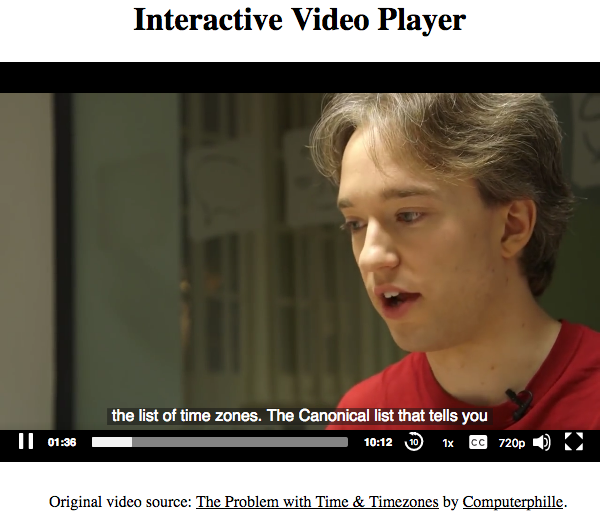
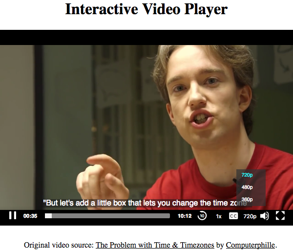
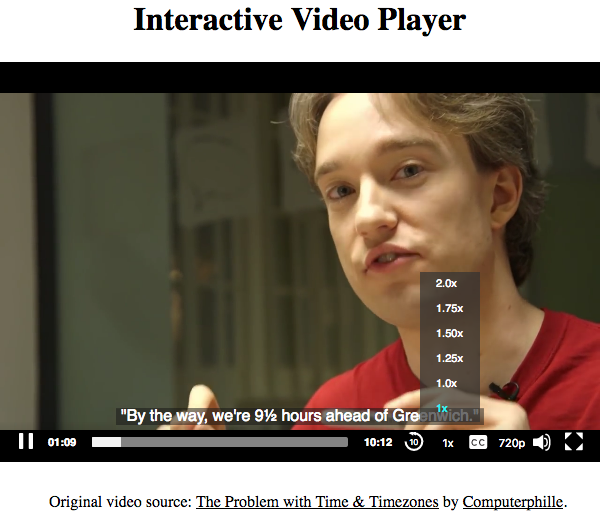
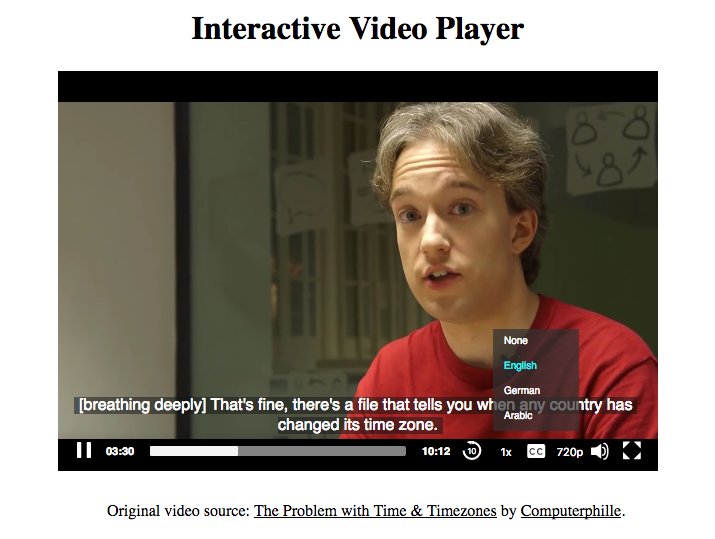
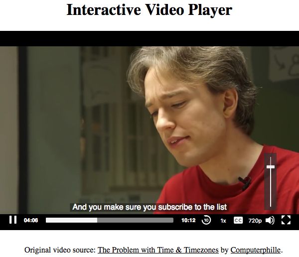

# Interactive Video Player

## Introduction

In this project, I created a HTML5 interactive video player using [mediaelementjs](http://www.mediaelementjs.com/) library. This interactive video player has these features:
1. Play/pause button
2. Current time and total duration
3. Playing progress slider
4. File buffer's progress
5. Skip backward
6. Playback speed chooser
7. Captions chooser
8. Video quality chooser
9. Volume level slider
10. Go to fullscreen button

### Demo pages

You can see the demo page [here](https://wahidyankf.github.io/interactive-video-player/).

## Testing

This app was tested using [HTML](https://validator.w3.org/) and [CSS](https://jigsaw.w3.org/css-validator/) validator.

## Sreenshots

## License

Source code: [MIT](https://en.wikipedia.org/wiki/MIT_License).

Video files: belong to [Computerphille Channel](https://www.youtube.com/channel/UC9-y-6csu5WGm29I7JiwpnA).